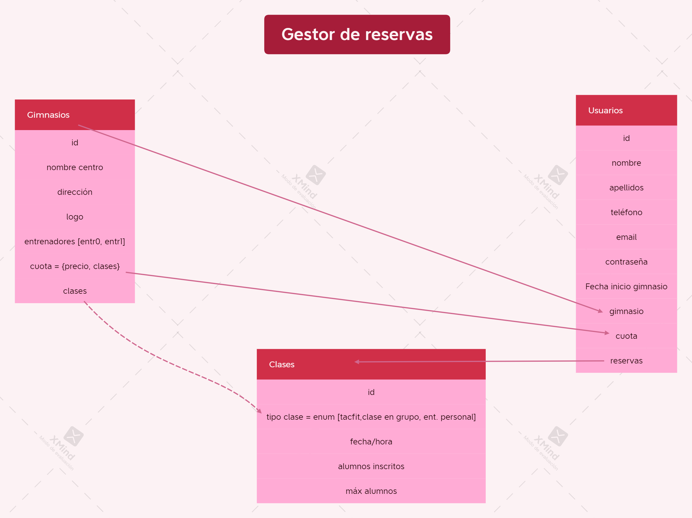

# Introducción a la página web
## Descripcion del proyecto.
La web consiste en un gestor de reservas de clases, la funcionalidad principal es que los usuarios, previa identificación del gimnasio en el que están inscritos, puedan reservar sus clases para entrenar, teniendo en cuenta su cuota (cuantas clases mensuales pagan). 
El usuario tendrá sus datos identificativos: id, nombre, apellidos, tlfn, email, contraseña y cuota.
Las clases tendrán aforo máximo y únicamente el usuario no podrá efectuar la reserva si las clases están completas. 
Los gimnasios también tendrán acceso a quien ha reservado sus clases, y podrán ver en todo momento todos los usuarios que están inscritos actualmente en el gimnasio. Cada gimnasio tendrá unas clases específicas. Cada gimnasio tendrá su id, nombre, contraseña, dirección, logo, bonos disponibles, entrenadores y clases.

## Tecnologías empleadas
- MongoDB para almacenar la BBDD.
- Postman para hacer de intermediario entre la BBDD y el backend.
- Visual Estudio Code
- Node js

## Instalaciones necesarias para ejecutar el proyecto.
- Instalar nodeJs y hacer un npm init en el editor de código.
- Instalamos express --> npm i express
- Instalamos mongoose --> npm i mongoose
- Crear un archivo .env que contenga las variables PORT (el puerto al que te quieres conectar), el URI de mongodb, y el JWT_SECRET.
- Tenemos que instalar el - npm install dotev
- Instalamos nodemon -> npm i -g nodemon (se instala de manera global)
- bcrypt para la encriptacion de la contraseña
- jsonwebtoken

## Descripción funcional de la aplicación
¿qué se puede hacer?
-   A nivel de usuario. Todas estas rutas van a ser privadas y necesitan el token del login.
    1.  Crear nuevo usuario (que estará vinculado con un gimnasio)introduciendo sus datos personales y asociarle la cuota pagada (dará lugar al número de clases). Dentro de las clases tendrá derecho a cualquiera de sus modalidades. 
    Ruta --> /api/authUser/signup✅ 
    Login. Ruta --> /api/authUser/login ✅
    2.  Mostrar todos usuarios disponibles en la BBDD.  Ruta --> /api/usuarios✅
    3.  Obtener 1 usuario por id y ver sus clases.  Ruta --> api/usuarios/find/:id ✅
    4.  Reservar una nueva clase. Ruta --> api/usuarios/inscribirse/:id ✅
    5.  Cancelar reservas. Ruta --> api/usuarios/delete/clase/:id✅
    6.  Modificar usuario. Ruta --> api/usuarios/update/:id✅
    7.  Borrar usuario, si el usuario estaba inscrito en alguna clase borrarlo. Ruta --> api/usuarios/delete✅

-   A nivel de Clases
    1.  Contendrán el id, el tipo de la clase (tacfit, entrenamiento personal, entrenamiento en grupo) la fecha y hora, los alumnos inscritos (llevara el id de cada alumno), y el máximo de alumnos.  Ruta --> api/clases/ (Post)✅
    2.  Las clases se actualizarán automáticamente cuando un usuario entre a la aplicación, y así la clase que ya haya finalizado se modificara y pasará a ser la de dentro de 7 días.  Ruta --> api/clases/updateClasses✅ Pública
    3.  Mostrar todas clases.  Ruta-->api/clases/ (get)✅
    4.  Mostrar todos los usuarios de todas las clases.  Ruta --> api/clases/todasClasesUsuarios✅
    5.  Mostrar 1 clase por id.  Ruta --> api/clases/find/:id ✅
    6.  Eliminar 1 clase.  Ruta --> api/clases/ (delete)✅
    7.  Actualizar una clase existente. Ruta -->api/clases✅

-   A nivel de gimnasio.
    1.  Creación gimnasio. Cada gimnasio tendrá su id, el nombre del centro, la dirección, un array con un objeto por cada entrenador [entr0, entr1] y un array con las distintas cuotas que ofrece el gimnasio (ej, cuota1 { precio : 55, clases : 8};) y el tipo de las clases que va a ofrecer: (tacfit, entrenamiento en grupo, entrenamiento personal). 
    Ruta --> /api/authGym/signup✅
    Y el gym se tendra que loguearse para acceder a todas las funcionalidades relativas a gyms:
    Ruta --> /api/authGym/login✅
    2.  Se podrán ver todos los gimnasios de la BBDD 
    Ruta--> api/gimnasios/allGyms✅
    3.  Buscar un gimnasio por su id. 
    Ruta --> api/gimnasios/find/:id✅
    4.  Actualizar los datos del gimnasio
    Ruta -->/api/gimnasios/✅
    5.  Borrar un gimnasio, tienes que estar conectado para poder borrarte. 
    Ruta --> /api/gimnasios/delete/:id ✅
    6.  Usuarios listados por cuota
    Ruta --> /api/gimnasios/listarCuotas/:id✅
    7. Mostrar el nombre de todos los usuarios de un gimnasio
    Ruta --> /api/gimnasios✅ 

- A nivel de cuotas (Fees). Son todas privadas (nivel Gym) menos ver todas cuotas y mostrar una cuota por id
    1. Crear cuota.  Ruta--> /api/cuotas  (post)✅
    2. Mostrar todos.  Ruta--> /api/cuotas   (get)✅
    3. Mostrar 1 por id.   Ruta-->/api/cuotas/:id (get)✅
    4. Actualizar cuota.  Ruta --> /api/cuotas/:id (put)✅ 
    5. Eliminar cuota.  Ruta --> /api/cuotas/:id (delete)✅ 

 
## Versiones
Version 1.0 sin FrontEnd, finalizada el 17/11/2021

## To do
1. Me gustaría pasar toda la aplicación a inglés,
2. Optimizar las funciones
3. Imagenes gym para logo
4. Modificar error de apuntarse a una clase, en lugar de mirarlo semanalmente, tiene que ser mensual y no borrar las clases.
5. fee indicar un nombre de cuota basica, premium, pro
6. eliminar las contraseñas de las pruebas que no interesen
