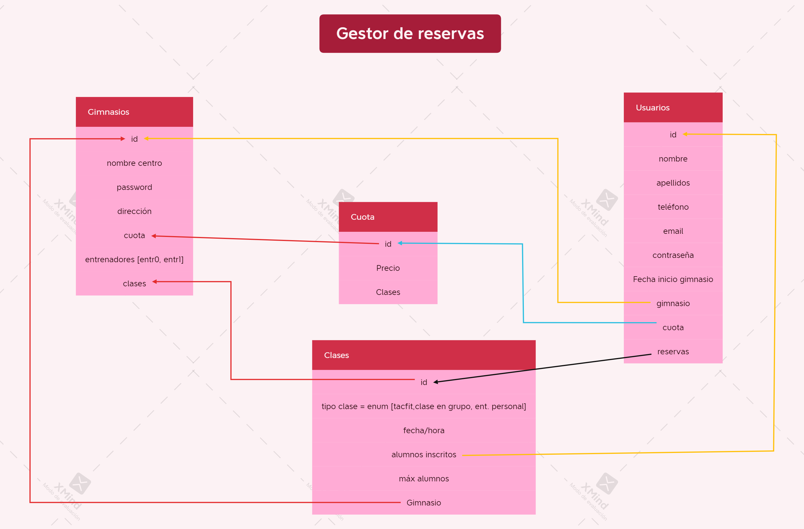

# Introducción a la página web
## ¿De que va la web?.
La web consiste en un gestor de reservas de clases, la funcionalidad principal es que los usuarios, previa identificación del gimnasio en el que están inscritos, puedan reservar sus clases para entrenar, teniendo en cuenta su cuota (cuantas clases mensuales pagan). 
El usuario tendrá sus datos identificativos: id, nombre, apellidos, tlfn, email, contraseña y cuota.
Las clases tendrán aforo máximo y únicamente el usuario no podrá efectuar la reserva si las clases están completas. 
Los gimnasios también tendrán acceso a quien ha reservado sus clases, y podrán ver en todo momento todos los usuarios que están inscritos actualmente en el gimnasio. Cada gimnasio tendrá unas clases específicas. Cada gimnasio tendrá su id, nombre, dirección, logo, bonos disponibles, entrenadores y clases.

## Descripción funcional de la aplicación
¿qué se puede hacer?
-   A nivel de usuario. Todas estas rutas van a ser privadas y necesitan el token del login.
    1.  Crear nuevo usuario (que estará vinculado con un gimnasio)introduciendo sus datos personales y asociarle la cuota pagada (dará lugar al número de clases). Dentro de las clases tendrá derecho a cualquiera de sus modalidades. ✅ Ruta --> /api/usuarios
    2.  Mostrar todos usuarios disponibles en la BBDD.  Ruta --> /api/usuarios✅
    3.  Obtener 1 usuario por id y ver sus clases.  Ruta --> api/usuarios/find/:id ✅
    5.  Reservar una nueva clase. Ruta --> api/usuarios/inscribirse/:id ✅
    6.  Cancelar reservas. Ruta --> api/usuarios/delete/clase/:id✅
    7.  Modificar usuario. Ruta --> api/usuarios/update/:id✅
    8.  Borrar usuario, si el usuario estaba inscrito en alguna clase borrarlo. Ruta --> api/usuarios/delete✅

-   A nivel de Clases
    1.  Contendrán el id, el tipo de la clase (tacfit, entrenamiento personal, entrenamiento en grupo) la fecha y hora, los alumnos inscritos (llevara el id de cada alumno), y el máximo de alumnos.  Ruta --> api/usuarios/delete/✅
    2.  Las clases se actualizaran automáticamente cuando un usuario entre a la aplicación, y así la clase que ya haya finalizado se modificara y pasará a ser la de dentro de 7 días.  Ruta --> api/clases/updateClasses✅
    3.  Mostrar todas clases.  Ruta-->api/clases/✅
    4.  Mostrar todos los usuarios de tooodas las clases.  Ruta --> api/clases/todasClasesUsuarios✅
    5.  Mostrar 1 clase por id.  Ruta --> api/clases/find/:id ✅
    6.  Eliminar 1 clase.  Ruta --> api/clases/delete/:id ✅

-   A nivel de gimnasio.
    1.  Creación gimnasio. Cada gimnasio tendrá su id, el nombre del centro, la dirección, el logo, un array con un objeto por cada entrenador [entr0, entr1] y un array con las distintas cuotas que ofrece el gimnasio (ej, cuota1 { precio : 55, clases : 8};) y el tipo de las clases que va a ofrecer: (tacfit, entrenamiento en grupo, entrenamiento personal). 
    Ruta --> /api/gimnasios (POST).✅
    2.  Se podrán ver todos los gimnasios de la BBDD 
    Ruta--> api/gimnasios/✅
    3.  Buscar un gimnasio por su id. 
    Ruta --> api/gimnasios/find/:id✅
    4.  Los gimnasios podrán ver todos los usuarios activos en su centro. 
    Ruta --> api/gimnasios/find/users/:id✅
    5.  Actualizar los dmatos del gimnasio
    Ruta -->/api/gimnasios/:id/update✅
    6.  Borrar un gimnasio por id. 
    Ruta --> /api/gimnasios/delete/:id ✅
    7.  Usuarios listados por cuota
    Ruta --> /api/gimnasios/:id/listarCuotas✅

- A nivel de cuotas (Fees)
    1. Crear.  Ruta--> /api/cuotas  (POST)✅
    2. Mostrar todos.  Ruta--> /api/cuotas   (GET)✅
    3. Mostrar 1 por id.   Ruta-->/api/cuotas/find/:id✅
    4. Actualizar cuota.  Ruta --> /api/cuotas/update/:id✅ 
    5. Eliminar cuota.  Ruta --> /api/cuotas/delete/:id✅ 

 
